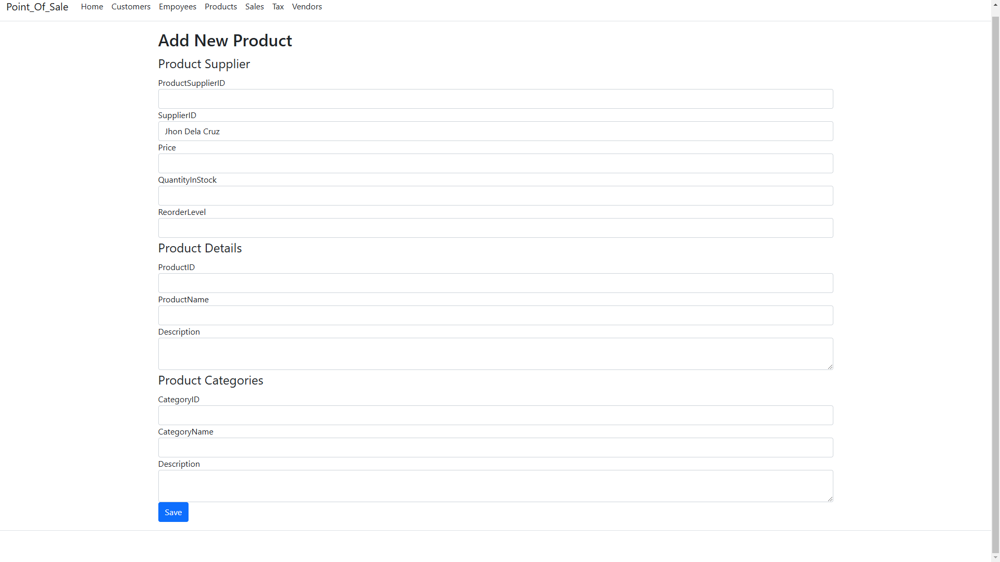

# PointOfSale-asp.net-core-MVC
## Introduction ##
Simple Point of Sale System using ASP.NET Core MVC with Entity Framework
## Features ##
* Reports
* Customer Management
* Employee Management
* Products Management
* Sales Management
* Tax & Discount Rules
* Vendor Management
## Installation ##
```
  git clone https://github.com/phil1217/PointOfSale-asp.net-core-MVC.git
```
## Database Design ##


## Screenshots ##





## License ##
[MIT License](LICENSE)
